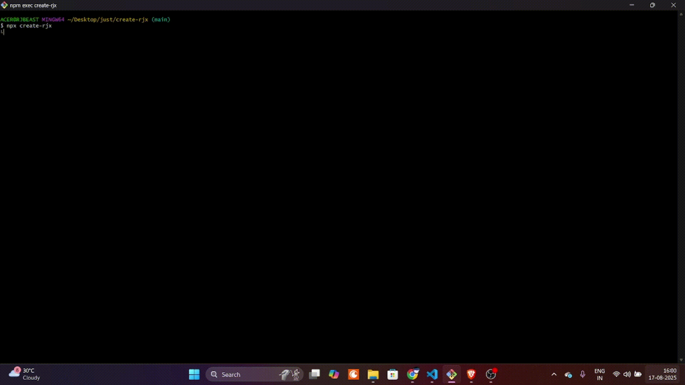
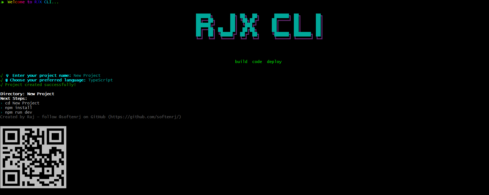

<div align="center">

# ✨ create-rjx

> The most animated and modern CLI to generate a full-featured Express.js boilerplate — powered by RJ

[](https://www.npmjs.com/package/create-rjx)
[](https://github.com/softenrj/create-rjx/releases)
[](https://www.npmjs.com/package/create-rjx)
[](LICENSE)

</div>

<div align="center">
  


</div>

---

## 🚀 What is `create-rjx`?

`create-rjx` is a **visually stunning**, developer-friendly CLI tool that **instantly scaffolds modern Express.js applications** in either **JavaScript or TypeScript** — with cinematic console animations, intelligent boilerplate generation, and production-ready architecture.

<div align="center">
  


</div>

---

## ✨ Why choose create-rjx?

- 🎨 **Cinematic CLI experience** with smooth animations and vibrant colors
- ⚡ **Lightning-fast setup** - get started in under 30 seconds
- 🎯 **Zero configuration** - works out of the box
- 🔧 **Production-ready** - includes best practices and modern tooling
- 📱 **Interactive prompts** with beautiful UI elements

---

## 💾 Installation

### Global Installation (Recommended)
```bash
npm install -g create-rjx
```

### One-time Usage
```bash
npx create-rjx
```

---

## 🖥️ Usage

### Quick Start
```bash
create-rjx
```

### With Project Name
```bash
create-rjx my-awesome-api
```

### Interactive Experience
The CLI will guide you through:
1. **Project naming** with real-time validation
2. **Language selection** (JavaScript vs TypeScript)
3. **Template generation** with progress indicators
4. **Success celebration** with animated confetti 🎉

---

## 🏁 Getting Started

After the magical creation process:

```bash
cd your-project-name
npm install
npm run dev
```

Your API will be running at `http://localhost:3000` with hot-reload enabled!

---

## 🎯 Features

### 🎨 Visual Experience
- **Cinematic animations** using chalk-animation and gradient-string
- **ASCII art headers** with figlet
- **Colorful progress bars** and spinners
- **Celebration effects** on successful creation

### ⚙️ Technical Excellence
- **Dual language support**: JavaScript & TypeScript
- **Modern Express.js** setup with async/await
- **Environment configuration** with dotenv
- **Development tooling** with nodemon
- **Clean architecture** with separation of concerns

### 📦 What's Included
- Express.js with modern middleware setup
- Environment variable configuration
- Development & production scripts
- Clean, scalable folder structure
- Ready-to-use API endpoints

## 🛠️ Tech Stack

### CLI Magic
- **chalk** - Terminal colors
- **chalk-animation** - Animated text effects
- **figlet** - ASCII art generation
- **gradient-string** - Color gradients
- **ora** - Elegant spinners
- **inquirer** - Interactive prompts
- **fs-extra** - Enhanced file operations

### Generated Projects
- **Express.js** - Web framework
- **dotenv** - Environment management
- **nodemon** - Development server
- **TypeScript** - Type safety (optional)

---

## 🎮 Demo & Examples

### Interactive CLI Experience
The CLI provides a **movie-like experience** with:
- Smooth transitions between steps
- Real-time progress feedback
- Color-coded success/error messages
- ASCII art celebration on completion

### Sample API Response
```json
{
  "message": "Welcome to your Express API!",
  "timestamp": "2024-01-15T10:30:00.000Z",
  "version": "1.0.0"
}
```

---

## 🤝 Contributing

We love contributions! Here's how you can help:

### Quick Contribution Guide
1. **Fork** the repository
2. **Create** a feature branch: `git checkout -b feature/amazing-feature`
3. **Commit** your changes: `git commit -m 'Add amazing feature'`
4. **Push** to the branch: `git push origin feature/amazing-feature`
5. **Open** a Pull Request

### Development Setup
```bash
git clone https://github.com/softenrj/create-rjx.git
cd create-rjx
npm install
npm link  # For local testing
```

---

## 💬 Support & Community

### Get Help
- 🐛 **Bug Reports**: [Open an issue](https://github.com/softenrj/create-rjx/issues)
- 💡 **Feature Requests**: [Start a discussion](https://github.com/softenrj/create-rjx/discussions)
- 📧 **Direct Contact**: [Email the author](mailto:rjsharmase@gmail.com)

### Connect with the Creator
- 🐙 **GitHub**: [@softenrj](https://github.com/softenrj)

---

## 🧠 Pro Tips

### Power User Features
- Use `create-rjx .` to create in current directory
- Add `--typescript` flag for TypeScript (coming soon)
- Use `--template api` for specific templates (coming soon)

### Best Practices
- Always check the generated `.env.example` file
- Use `npm run clean` before switching between JS/TS
- Keep your CLI updated: `npm update -g create-rjx`

---

## 📄 License

**MIT License** - feel free to use this in any project, commercial or personal.

---

<div align="center">

### ✍️ Made with ❤️ and lots of ☕ by Raj

**[⭐ Star this repo](https://github.com/softenrj/create-rjx)** if you found it helpful!

</div>
